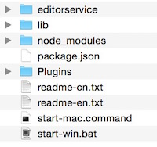
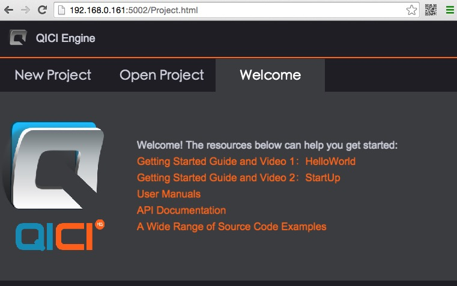
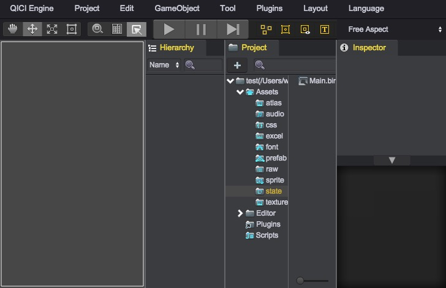
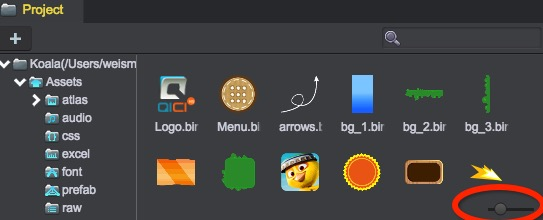
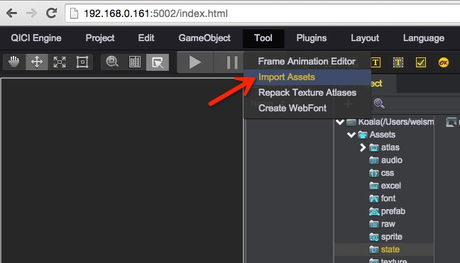
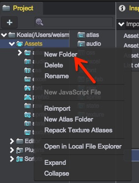
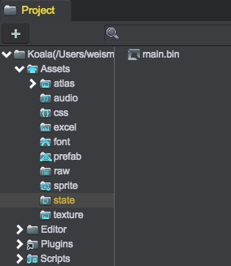
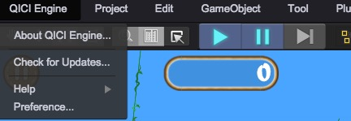
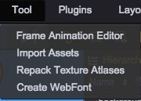
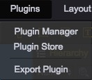

# Chapter 1 - The QICI Engine Editor
The most exciting part of learning a new application is getting it installed and firing it up for the first time. Following that, the most frustrating part can be the process of becoming familier with its editing environment. In this chapter, you will be introduced to the QICI Engine editor and many of its key concepts. As this will serve as a light overview for the rest of the book, don’t stress over trying to remember it all.

## Installing QICI Engine
The first order of business is to download and install node.js if you have not already done so. You can download the node.js from [here](https://nodejs.org/en).  
**Notice:** Only v0.12.x and v4.1+ are supported.  

Then download QICI Engine noinstall zip from [GitHub](https://github.com/qiciengine/qiciengine/tree/master/releases), and unzip it.  

At this point, you should now see a list of all the files and folders (Figure 1-1).    
  
**Figure 1-1.** 

## Running QICI Engine
Double-click the file **"start-mac.command"** to open QICI Engine (choose **"start-win.bat"** in a Windows environment). The editor will be opened in browser automatically and the Start-up Interface is shown as following figure:  
    
  **Figure 1-2.**  

The QICI Engine runs on any browser that supports HTML5 and accesses to local disks by node.js. In other words, the QICI Engine starts a web server by node.js and runs the editor on the browser. So you can even run the QICI Engine on a iPad/iPhone/android by wireless LAN. It sounds inconceivable but is the naked truth.   
**Notice:** Use Google Chrome browser for better performance.   

## Project Wizard
QICI Engine is a project-based application. In practice this means every time you make a new game, you'll make a new project. In QICI Engine, 1 project = 1 game. A project is simply a container for all your game files and data. It corresponds to a folder on your hard drive, and that folder houses all the files for your game project during its development.  

From the Start-up Interface, you can create a new project or browse to open an existing project. Now let's create a new project step by step:  
  1. In the Start-up Interface, select the **'New Project'** tab.
  2. Set the Project Location manually using the **'Set...'** button.
  3. Click the **'Create'** button. The new project and, as yet nameless, scene opens in the QICI Engine editor.  
**Notice:** Make sure the destination directory is empty when creating a new project.    

## Portrait Layout
With the project loaded, QICI Engine displays the default interface (Figure 1-2). This is where we'll spend most of our time during making games. The default layout is 'Portrait Layout', the other is 'Landscape Layout'.  
    
  **Figure 1-2**  

QICI Engine's UI consists of four main "views" and several importmant features. The Scene view (or Game view), Hierarchy view, Project view and Inspector view (typically referred to as the Inspector) are generally accessible in the Portrait Layout and Landscape Layout, showned as following figure:  
    
  **Figure 1-3**  

## Project view
This acts much like a folder view, showing the contents of the Project folder on the hard drive. For new projects, this panel typically begins completely empty. But as we add our own images and other data, it populates with items. You can open the Project folder directly from the Project Panel in either Windows Explorer on Windows or Finder on Mac. To do that, right-click the mouse inside the Root Folder (inside the Project view) and select **'Open in Local File Explorer'** from the context menu.  

The Project view has two panels. Left panel display the project folders structure. When the folder is selected, all the sub-folders and files will be listed on the right panel. On the top right corner there is a search input field, which can be used for search assets with the match file name. The search results are according to the selected folder in the left folders structure panel.   
**Notice:** There is no “undo” for deleting files.    

In the lower right of the view, adjust the slider from left to right to see the changes in thumbnail size and presentation (Figure 1-4):  
    
  **Figure 1-4.**  

The Project folder typically contains 7 subfolers: Assets, Build, Editor, Plugins, ProjectSetting, Scripts and Temp. The Project view in the QICI Engine editor displays the contents of only the Assets, Editor, Plugins, and Scripts.  

The folders contain meta-data, and they should be managed by the QICI Engine editor exclusively. It is highly recommended never to manually remove or edit files from anywhere inside the Project folder or its subfolders. Doing so could lead to corrupted or damaged projects if the files are not copied in the proper way. I’m simply discussing the Project folder here so you know where it is, and its general structure. As you are probably beginning to understand, QICI Engine's file structure is fairly rigid. This ensures that assets will not go missing at crucial times.  

Another importmant thing to know about QICI Engine projects is that there is no quick way to back them up unless you are using a version-control system such as SVN, GIT, Perforce, or PlasticSCM.  

## Assets and Project Files
The project is the home of all your game files; all the files that make up your game. These may include textures, animations, sounds, music, excel, and more. These files are together named Assets by the QICI Engine. Each file is a unique asset. When you want to put a object or file inside your game, you’ll need to import it first as an asset of the project. You can import assets into the Project using either of two methods. You can select  'Tool/Import Assets' from the main menu (Figure 1-4), or you can drag and drop files from Windows Explorer or Mac Finder directly into the Project view.   
    
  **Figure 1-4.**  

Once the asset is imported, it appears in the Project view. QICI Engine accepts many different file formats.  

| Textures | Audio | Others |
| :-----:|:----:| :----:|
| .png    | .mp3    | .xls    |
| .jpg    | .ogg    | .json   |
| .jpeg   |         | .ani    |  
| .gif    |         | .xlsx   |  
|         |         | .xml    |
|         |         | .prefab |
|         |         | .state  |
|         |         | .txt    |
|         |         | .wfont  |

Games typically make use of lots of assets - perhaps hundreds. Speaking about assets generally, it’s good practice to organize your assets in the Project view into subfolders. This ensures you can find your assets quickly and when you need them. Textures are typically arranged in one folder, audio files in another, and so on. Avoid mixing together assets of different types. To create folders directly from the Project view, right-click in the parent folder and choose **'New Folder'** from the context menu (Figure 1-5).  
    
  **Figure 1-5.** 

## Scenes
When you've created a project and imported all your assets, it's usually time to start making the levels in your game. In QICI Engine, a level (or an environment) is termed a scene. 1 scene = 1 level. Most of games feature multiple levels, and so most projects feature multiple scenes. To create a new scene, select **'Project/New Scene'** from the main menu, or press the keyboard shortcut Ctrl+N on Windows or Command+N on Mac. After creating a scene, be sure to save it by selecting **'Project/Save Scene'**. Once saved, the scene will be added to the project as an assets. Scenes are assets too.  
**Notice:** Keep scene files in the 'Assets/state' folder, and don't try to move them.  

You can open up and examine any scene in your project by double-clicking it from the Project view. Every time you create a new scene, it will automatically be opened for you. When you open a scene in the editor, you can build your levels and examine them.  

Everything inside a scene is a node. Characters, weapons, particle systems, sounds, enemies; all of these are examples of nodes - each individual thing is a node. If you've imported a texture asset into QICI Engine, you can drag and drop it from the Project view into the Scene view to instantiate an instance of it in the scene. That instance is a node. You can drag and drop the object multiple times to create multiple instances in the scene, and thereby multiple game objects. In short, the Hierarchy view lists all nodes in the scene, and in order to create a game you'll need to work with lots of nodes. Nodes will be explained in detail in later chapters.   

Most of the time, you'll move, rotate, or scale the nodes in the Scene view. You can place the nodes in the Scene view like so:  
<video controls="controls" src="../video/place_asset.mp4"></video>  

## Game view
When you click the Play button, the Scene view switchs to the Game view. The game view is where you will interact with your scene at runtime to test your game play.  

As you test your game in QICI Engine, the game view will update itself with the current game's state, and you can even add new elements on-the-fly to the scene. When you stop the game, the scene view will revert to its original state. Any changes you make to the Game view while you're playing the game will be lost when it stops. See the video:  
<video controls="controls" src="../video/gameview.mp4"></video>

## Hierarchy view
The Hierarchy view is essentially a list tree of the objects currently in the loaded or active scene. The key word here is "currently" because during run-time, objects can be "instantiated" (created on the fly) or destroyed (deleted from the scene). This is an important concept in QICI Engine, and it is one of the reasons that most changes made during run-time are not permanent. On exiting Play mode, the Hierarchy view will be returned to its former state.  

During your experimenting with the viewport, you may have accidentally clicked on an object in the Scene view. When selected that way, the hierarchy in the Hierarchy view will be expanded to show the picked object. As you may have noticed, some of the objects are children of children of the top-level objects in the scene. With this in mind, you can imagine how difficult it can be to locate particular objects it can in either the Scene or Hierarchy view. As the book's project comes together, you will be importing and using several perfabs (QICI Engine term for reference objects) and will want a quick means of locating them in the current scene.  

Fortunately, QICI Engine has a nice search function for that very purpose. At the top of the Hierarchy view, to the right of the '+' arrow, you will see a small magnifying glass icon and its drop-down arrow. The drop-down menu will let you filter for All, Name, or Type.  
    
  **Figure 1-6.**  

Nodes can also contain other nodes, which makes them quite useful for organizing your scene. Here a tiny preview into the fun you will have:    
<video controls="controls" src="../video/hierarchy.mp4"></video>

A Scene typically represents a single level of your game, although you could theoretically put the entire game inside one scene. Any nodes actively being used in your game in the current scene will appear in the Hierarchy. When you delete a node from the Hierarchy, you’re effectively removing it from the scene.  

## Inspector view
This is where you will have access to the parameters, options, and other particulars of selected assets, from the Hierarchy or Project views, as well as general project-related settings. As you may have noticed, its functionality and options are directly related to the item that is selected elsewhere in the editor. As you become more familiar with QICI Engine, you will spend a lot of time in the Inspector. It is where you will gain access to almost everything related to your game in QICI Engine.  

## Toolbar
You use the toolbar to manipulate the various nodes in the Scene view. You’ll be using the following tools a lot as you develop your game, so get familiar with them by trying out all of them on your empty project!  

### The Hand tool
Move the whole canvas in Scene view; shortcut key is **Q**.  
    
  **Figure 1-7.**   
Select the Hand tool, then drag over the Scene view to pan the entire scene:    
<video controls="controls" src="../video/hand.mp4"></video>  

### The Translate tool
Lets you select and position a node in the scene; shortcut key is **W**:   
    
  **Figure 1-8.**  
There are many ways to move your node with the Translate tool.  
  * You can select one of the arrows, then move the mouse; the node will only move on that one axis.  
  * The colored rectangle lets you move the node on two axes.  
  * The red point in the center of the x axes lets you rotate the node.  
  * The colored circle lets you reset the pivot point, which is the center point of rotation for the object. 

See the video:  
<video controls="controls" src="../video/translate.mp4"></video>  

### The Scale tool
The rotate tool, unsurprisingly, lets you rotate objects; shortcut key is **E**. And the colored rectangle let you move the node on two axes.  
    
  **Figure 1-9.**  
video:    
<video controls="controls" src="../video/scale.mp4"></video>  
  
### The Rect tool
The Rect tool is primarily used with User Interface (UI) nodes.  
    
  **Figure 1-10.**  
The tool can resize nodes and reset the anchors that we will explain later chapters.  
See the video:  
<video controls="controls" src="../video/rect.mp4"></video>  

Can you guess its shortcut key? That's right, it's **R**. 

### The Zoom tool
You can use the mouse wheel to zoom in or zoom out the scene canvas. This tool lets you zoom the scene to fit content. It's short key is **T**.  
    
  **Figure 1-11.**  

### The Ruler tool
This tool lets you show/hide the ruler in the Scene view. It's shortkey is **Y**.  
    
  **Figure 1-12.**  

### The Pick tool
This tool is enabled only in the Game view. When playing the game and the tool is selected, you can manipulate the node.  
    
  **Figure 1-13.**   
See the video:    
<video controls="controls" src="../video/pick.mp4"></video>  

### Play Buttons
The Play Buttons let you start and stop your game. The first button is the Play button:  
    
  **Figure 1-14.**   
A few things happen when you press Play; First, your game will start, as expected. The button set will also turn blue to indicate the game is in motiion:    
    
  **Figure 1-15.**   

Remember again, any changes you make on-the-fly will be lost once you stop the game. It’s a common mistake for QICI Engine beginners and regulars alike to run the game and make a pile of changes – which all disappear when the game stops!   

The next button is **Pause**:  
    
  **Figure 1-16.**   
This pauses your game and lets you make modifications to the game. Jusk like in play mode those modifications will be lost once you stop the game. Regard editing game objects during play and pause as a cheat and balancing system that allows you to experiment on your game without the danger of permanently breaking it.  

The final button is **Step**:    
    
  **Figure 1-17.**  
This lets you step through your game once frame at a time; it's handy when you want to observe animations on a frame-by-frame basis, or when you want to check the state of particular nodes during gameplay:  
<video controls="controls" src="../video/step.mp4"></video>  

### GameObject Buttons
This lets you create gameobjects, for example, a Sprite, a Sound, a Node, and son on. These buttons will be explained in detail in later chapters.  

### The aspect drop-down menu
This allows you to specify an aspect ratio so you can make sure you will be seeing what your player will see (Figure 1-18).  
    
  **Figure 1-18.**   

## Menus
The menu bar consists of eight menus, a few of which may already be familiar to you from other applications.  

In the QICI Engine menu (Figure 1-19), you can find access to the QICI Engine documentation: the manual, where you can find information on the workings and concepts behind much of the QICI Engine workflow and features; and the API, where you can find QICI-specific API classes, examples, and scriping tips. Additionally, the menu supplices links to the Forum.  
    
  **Figure 1-19.**   

The Project menu (Figure 1-20) is where you will save and load scenes and projects. It is also where you will modify your game settings and publish your game.  
    
  **Figure 1-20.**   

In the Edit menu (Figure 1-21), you will find the usual editing options: Undo, Redo, Cut, Copy, Paste, Duplicate and Delete. The Play options are fairly self-explanatory. You will investigate Find later in the chapters.  
    
  **Figure 1-21.**   

In the GameObject menu (Figure 1-22), you will be able to create several types of pre-set objects provided by the QICI Engine. This menu is the same as the 'GameObject Buttons' in the Toolbar.    
    
  **Figure 1-22.**  

There are 4 tools in the Tool menu (Figure 1-23). You will investigate Find later in the chapters.  
    
  **Figure 1-23.**  

The Plugins menu is where you can add/remove plugins for your game. For example, Physics and Particle System are provided here.    
    
  **Figure 1-24.**  

The Layout menu provides two editor layouts: Portrait Layout and Landscape Layout.  
    
  **Figure 1-25.**  

The last menu is Language menu. There are two languages: Chinese and English.  
    
  **Figure 1-26.**  

## Develop Tools
The Chrome Developer Tools (DevTools for short), are a set of web authoring and debugging tools built into Google Chrome. The DevTools provide web developers deep access into the internals of the browser and their web application. Use the DevTools to efficiently track down layout issues, set JavaScript breakpoints, and get insights for code optimization.  

See: [Chrome DevTools](https://developer.chrome.com/devtools).
